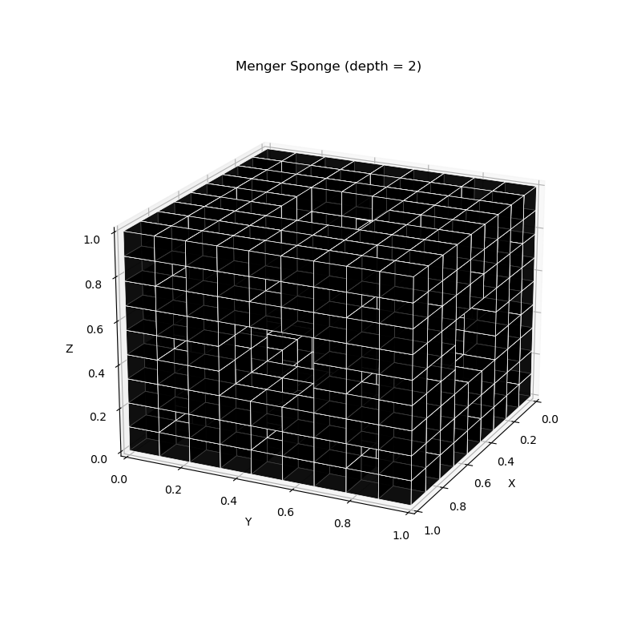
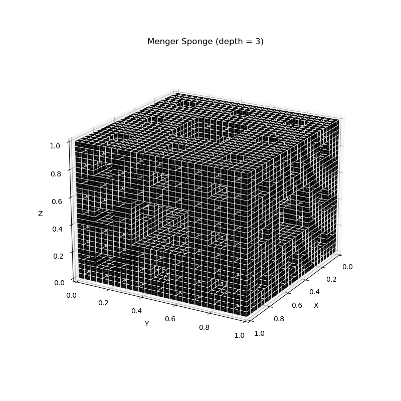

# menger-sponge-vis
A python script that creates an interactive 3D visualization of a Menger sponge.

## Description
The Menger sponge is a three-dimensional fractal that is created by repeatedly removing smaller cubes from a larger cube based on its coordinate triplet position. This visualization tool uses matplotlib's built-in 3D plotting capabilities to create an interactive view of the fractal at different recursion depths.

## Usage
1. Clone this repository
2. Install required packages: `pip install -r requirements.txt`
3. Run the program with a recursion depth parameter: `python DrawMengerSponge.py <depth>`

Example:
```bash
python DrawMengerSponge.py 3
```

## Example Visualizations
<div align="center">
<table>
<tr>
  <td><br/>Depth 0</td>
  <td><br/>Depth 1</td>
</tr>
<tr>
  <td><br/>Depth 2</td>
  <td><br/>Depth 3</td>
</tr>
</table>
</div>